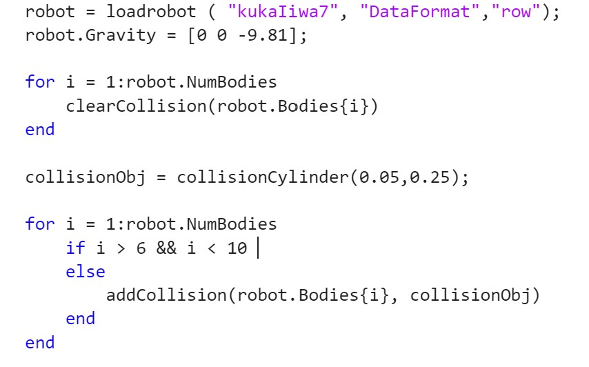
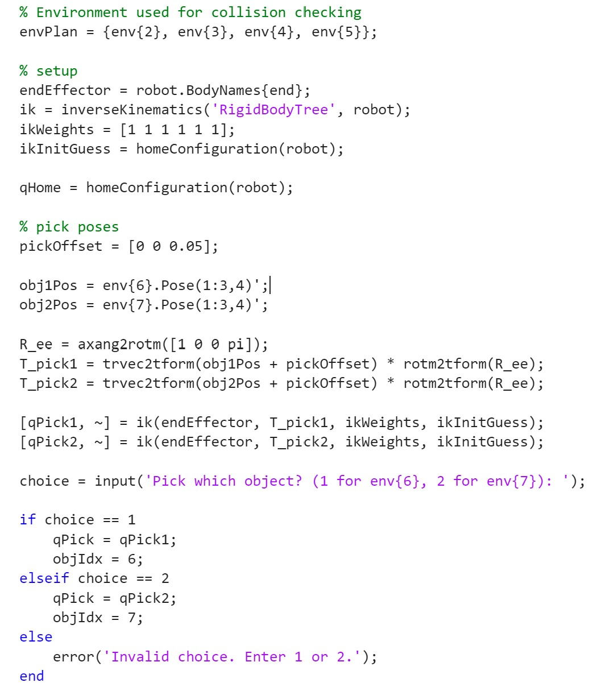
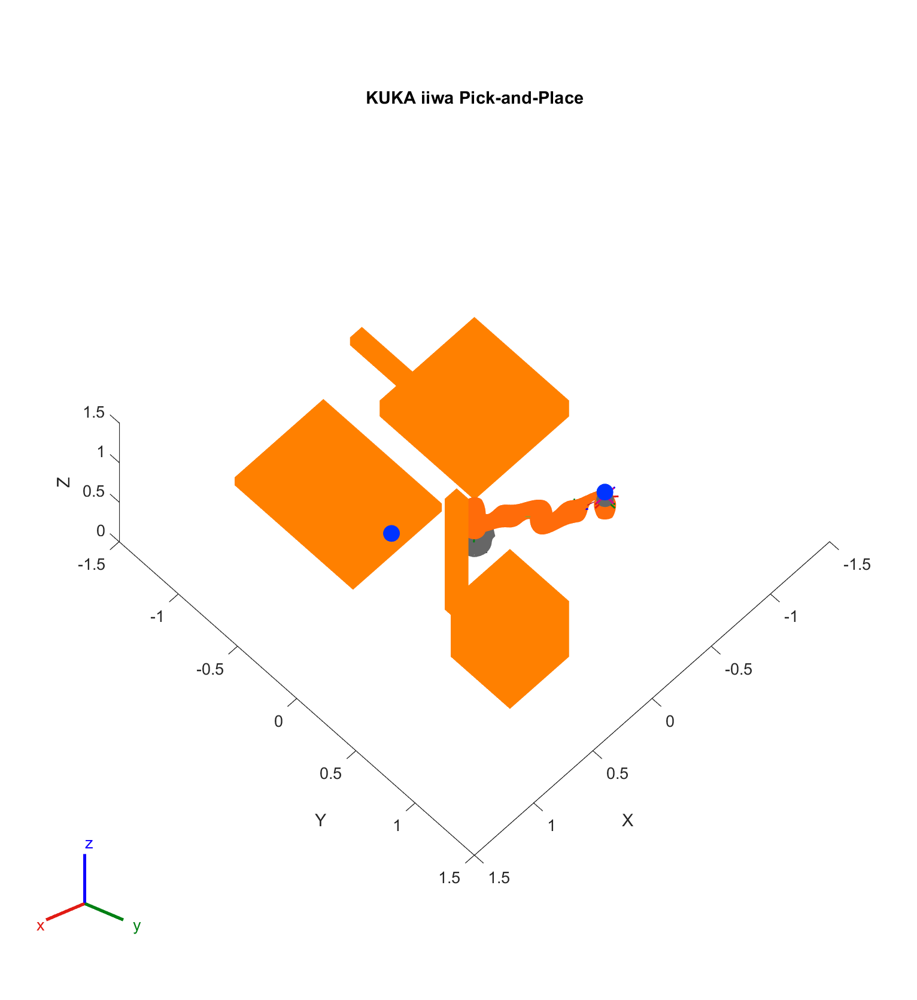

# KUKA iiwa Collision-Aware Pick-and-Place (MATLAB)

This project demonstrates a **collision-aware pick-and-place task** using a KUKA iiwa robot model. The system integrates **inverse kinematics (IK)**, **environment collision modeling**, and **RRT-based motion planning** to autonomously move objects between platforms while avoiding obstacles.

A short screen recording of the system running is included below, along with highlighted implementation figures illustrating the core system behavior.

---

## Project Overview
The goal of this project was to design a motion-planning pipeline that allows a robotic manipulator to:

1. Identify and reach a pick object  
2. Safely transport the object through a cluttered workspace  
3. Place the object at a user-defined target location without collisions  

Rather than focusing on low-level robot dynamics, this project emphasizes **planning logic, collision reasoning, and system integration**.

---

## Key Implementation Highlights

### Robot Import & Collision Modeling

   
  <em>Figure – KUKA iiwa robot model with simplified collision geometries applied to each link.</em>

The KUKA iiwa robot is imported as a rigid-body model and augmented with simplified collision geometry.  
Custom collision shapes are assigned to robot links to enable **fast and reliable collision checking** during motion planning, independent of visual meshes.

---

### Collision-Safe Pick & Place Logic

   
  <em>Figure – Inverse kinematics solution used to compute collision-safe pick and place configurations.</em>

Inverse kinematics is used to compute feasible pick and place poses for the end effector.  
A collision-aware search strategy evaluates candidate IK solutions and selects the closest **valid, collision-free configuration** when the user-defined target pose is not directly reachable.

---

### RRT Motion Planning & Execution

   
  <em>Figure – Rapidly-exploring Random Tree (RRT) planning results for collision-free joint-space motion.</em>

A Rapidly-exploring Random Tree (RRT) planner is used to generate collision-free joint-space trajectories.  
Separate motion plans are generated for the **Home → Pick** and **Pick → Place** segments, which are then concatenated and interpolated to produce smooth execution.

---

## System Demonstration

The video below shows the robot executing the full task:
- Moving from the home configuration  
- Picking one of two objects  
- Transporting the object while avoiding obstacles  
- Placing the object at the target location  

   
  <em>Figure – Collision-aware pick-and-place task execution. Click the image to watch the full demonstration.</em>

---

## Tools & Concepts Used
- MATLAB Robotics System Toolbox  
- RigidBodyTree modeling  
- Inverse kinematics  
- Collision checking  
- RRT motion planning  
- Trajectory interpolation and visualization  

---

## Outcome
This project demonstrates a complete **collision-aware robotic manipulation pipeline**, illustrating how kinematic modeling, collision reasoning, and sampling-based planning algorithms can be integrated to produce reliable autonomous behavior in a constrained workspace.
